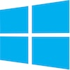

This project is a reimplementation of the famous R-Type game. Our version is playable in network with multiple clients able to connect to the server.

This project works on :

    
The project runs on Windows and Unix systems, using [CMake](https://cmake.org/).  


## Usage
The latest version from our game can be found in the [release section of the Github repository](https://github.com/EpitechPromo2026/B-FUN-500-PAR-5-1-glados-theo.fouque/releases).

A local version can be compiled after cloning the repository or downloading the latest source code from the [release section of the Github repository](https://github.com/EpitechPromo2026/B-FUN-500-PAR-5-1-glados-theo.fouque/releases) and executing the following commands at the root of the repository :
```
make
```

### Client
```
./r-type_client [IP] [port]
```

### Server
```
./r-type_server
```
## Documentation
### In-code documentation
Our in-code documentation can is written directly in our sources files and can be clearly formated with Doxygen by executing this command at the root of the repository once cloned :
```
make doc
# doxygen is required
```
A webpage should automatically open with the generated documentation.
### Other documentations
All other documentations (including RFC protocol between client and server) can be found in [the Wiki section of the Github repository](https://github.com/EpitechPromo2026/B-CPP-500-PAR-5-2-rtype-jules.gresset/wiki).

## Contribution
To contribute to this project, check our [Contribution Guidelines](https://github.com/EpitechPromo2026/B-CPP-500-PAR-5-2-rtype-jules.gresset/blob/main/docs/CONTRIBUTING.md).

## Authors and contact
- [alecorver](https://github.com/alecorvec) adrien.le-corvec@epitech.eu
- [JulesGresset](https://github.com/JulesGresset) jules.gresset@epitech.eu
- [Lucaslgd02](https://github.com/Lucaslgd02) lucas.guiard@epitech.eu
- [Xantas](https://github.com/Xantass) theo.fouque@epitech.eu
