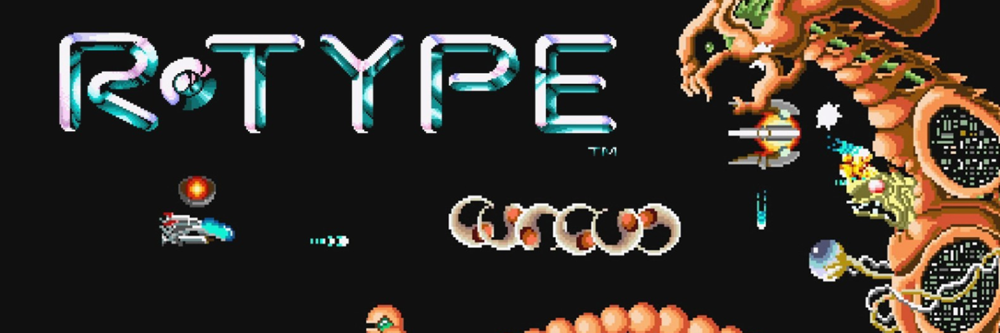

This project is a reimplementation of the famous R-Type game. Our version is playable in network with multiple clients able to connect to the server.

This project works on :

    
The project runs on Windows and Unix systems, using [CMake](https://cmake.org/).

## 📥 Getting the code
The easiest way to get hold of the starter code is to run the following command using a shell you can run git from:

```
git clone https://github.com/EpitechPromo2026/B-CPP-500-PAR-5-2-rtype-jules.gresset.git
```
You can also directly download the source code from the [Github repository](https://github.com/EpitechPromo2026/B-CPP-500-PAR-5-2-rtype-jules.gresset.git).

### Using make and CMake to create the project

After downloading the source code, you can juste Make at the root of the repository:
```
make
```

## 🎮 Usage
The latest version from our game can be found in the [release section of the Github repository](https://github.com/EpitechPromo2026/B-FUN-500-PAR-5-1-glados-theo.fouque/releases).

### Client
```
./r-type_client [server IP] [server port] [player name] [player port]
```

### Server
```
./r-type_server
```
## 📑 Documentation
### In-code documentation
Our in-code documentation can is written directly in our sources files and can be clearly formated with Doxygen by executing this command at the root of the repository once cloned :
```
make doc
# doxygen is required
```
A webpage should automatically open with the generated documentation.
### Other documentations
All other documentations (including RFC protocol between client and server) can be found in [the Wiki section of the Github repository](https://github.com/EpitechPromo2026/B-CPP-500-PAR-5-2-rtype-jules.gresset/wiki).

## 📮 Contribution
To contribute to this project, check our [Contribution Guidelines](https://github.com/EpitechPromo2026/B-CPP-500-PAR-5-2-rtype-jules.gresset/blob/main/docs/CONTRIBUTING.md).

## 📝 License
This project is released under the [MIT license](https://github.com/EpitechPromo2026/B-CPP-500-PAR-5-2-rtype-jules.gresset/blob/main/docs/LICENSE.md).

## 👭 Authors and contact
|  |   |  |  |  |
|:-:|:-:|:-:|:-:|:-:|
|[Adrien Le Corvec](https://github.com/alecorvec)|[Jules Gresset](https://github.com/JulesGresset)|[Lucas Guiard](https://github.com/Lucaslgd02)|[Théo Fouque](https://github.com/Xantass)|[Arthur Beaudelot](https://github.com/Toki973)
|adrien.le-corvec@epitech.eu|jules.gresset@epitech.eu|lucas.guiard@epitech.eu|theo.fouque@epitech.eu|arhur.beaudelot@epitech.eu|
